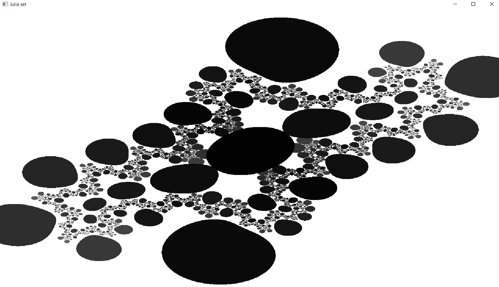

# complex_numbers

A `Rust` program to implement complex numbers and compute them.



## Julia set algorithm

From [Wikipedia](https://en.wikipedia.org/wiki/Julia_set)

```
R = escape radius  # choose R > 0 such that R**2 - R >= sqrt(cx**2 + cy**2)

for each pixel (x, y) on the screen, do:   
{
    zx = scaled x coordinate of pixel # (scale to be between -R and R)
       # zx represents the real part of z.
    zy = scaled y coordinate of pixel # (scale to be between -R and R)
       # zy represents the imaginary part of z.

    iteration = 0
    max_iteration = 1000
  
    while (zx * zx + zy * zy < R**2  AND  iteration < max_iteration) 
    {
        xtemp = zx * zx - zy * zy
        zy = 2 * zx * zy  + cy 
        zx = xtemp + cx
    
        iteration = iteration + 1 
    }
  
    if (iteration == max_iteration)
        return black;
    else
        return iteration;
}
```